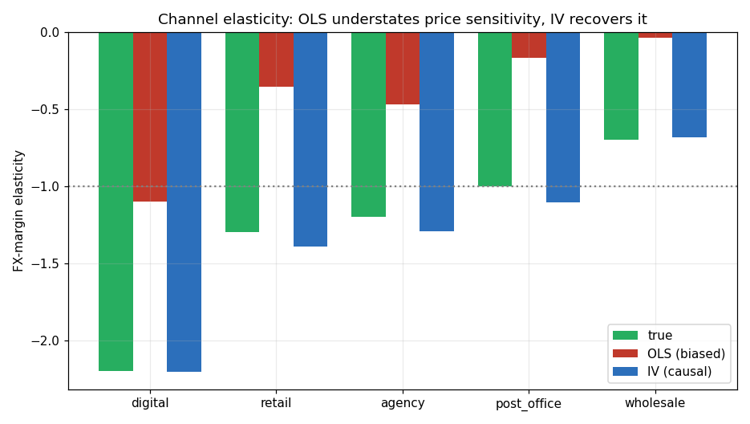
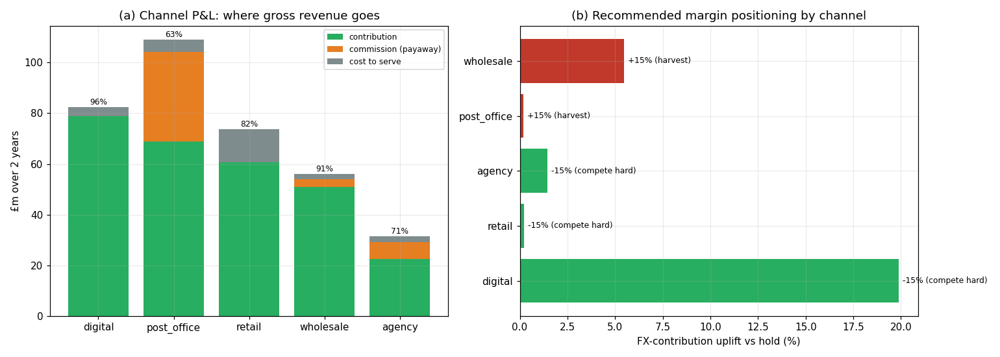
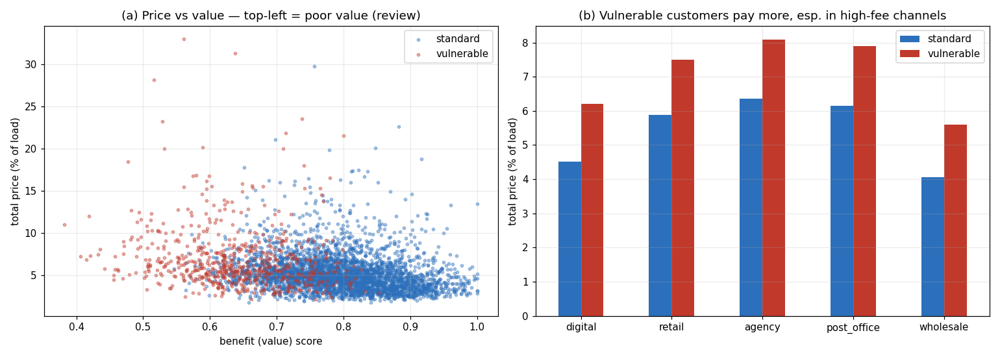
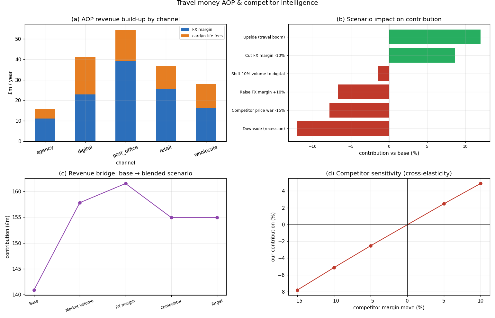

# Role Case Study Results — Travel Money & Prepaid Card Pricing

_Auto-generated by `run_role_case_study.py` (synthetic, fixed seed). Aligned to the Senior Manager, Pricing, Distribution & Revenue remit._

## 1. Channel FX-margin elasticity (causal)

| Channel | True ε | OLS ε | IV ε | First-stage F |
|---|---:|---:|---:|---:|
| digital | -2.20 | -1.10 | -2.21 | 1,048 |
| retail | -1.30 | -0.36 | -1.39 | 1,401 |
| agency | -1.20 | -0.47 | -1.29 | 2,119 |
| post_office | -1.00 | -0.17 | -1.10 | 1,684 |
| wholesale | -0.70 | -0.04 | -0.68 | 2,580 |

Digital is the most price-sensitive channel (price-transparent); wholesale the least. OLS understates sensitivity everywhere — pricing on it would systematically over-charge.

## 2. Distribution economics

| Channel | Gross rev | Commission | Cost | Contribution | Contrib margin | Rec. move |
|---|---:|---:|---:|---:|---:|---|
| digital | £82.4m | £0.0m | £3.4m | £79.0m | 96% | -15% (compete hard) |
| post_office | £109.1m | £35.4m | £4.8m | £68.9m | 63% | +15% (harvest) |
| retail | £73.7m | £0.0m | £13.0m | £60.8m | 82% | -15% (compete hard) |
| wholesale | £56.0m | £3.3m | £1.9m | £50.8m | 91% | +15% (harvest) |
| agency | £31.5m | £6.7m | £2.4m | £22.4m | 71% | -15% (compete hard) |

The same FX margin earns very different *net* contribution by channel: the Post Office network pays ~45% of FX revenue away in Postmaster commission, retail carries the highest cost-to-serve, while digital drops almost all revenue to contribution. Elastic channels should compete on margin; inelastic channels (wholesale, Post Office) should harvest.

## 3. FCA Consumer Duty — fair value

- Vulnerable customers pay **+1.7pp** more (7.0% of load vs 5.3%) for **lower** benefit, and **44%** are flagged Red vs 9% of standard customers.
- Driven by ATM and **inactivity fees eroding unspent balances** in the high-fee channels (agency, Post Office, retail).
- See `../04_satisfy_the_regulator/02_fair_value_assessment.md` for the full assessment and remediation actions.

## 4. Annual Operating Plan

Annualised gross revenue **£176m** (FX £115m + fees £61m). Scenario impact on contribution:

| Scenario | Contribution vs base |
|---|---:|
| Upside (travel boom) | +12.0% |
| Downside (recession) | -12.0% |
| Raise FX margin +10% | -6.7% |
| Cut FX margin -10% | +8.6% |
| Competitor price war -15% | -7.8% |
| Shift 10% volume to digital | -1.5% |

Note a **uniform** +10% FX-margin rise *reduces* contribution (blended demand is elastic), whereas the channel-specific positioning in §2 *raises* it — uniform pricing moves destroy value; targeted ones create it.

## Figures

