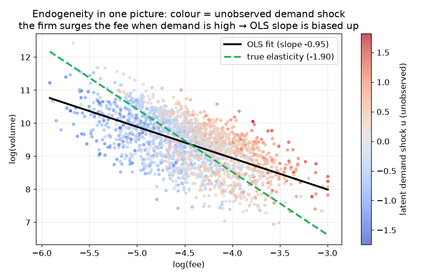
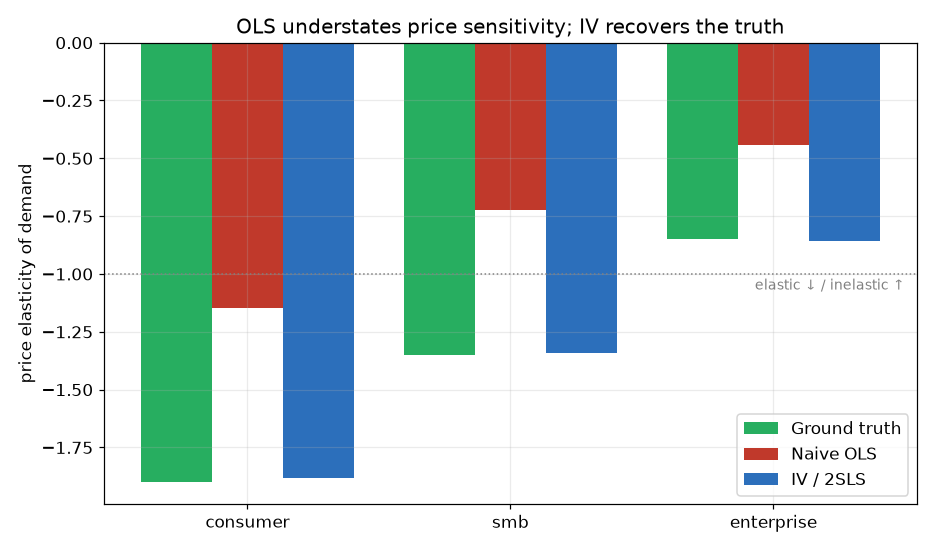
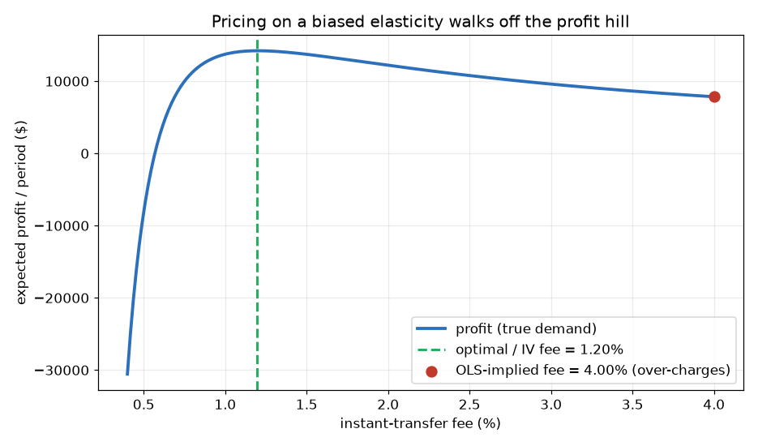
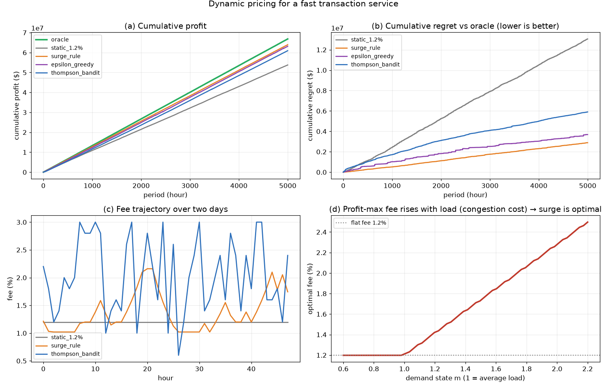

# Case Study Results — Dynamic Pricing for a Fast Transaction Service

_Auto-generated by `run_case_study.py`. Numbers are from the synthetic `FastPay` simulator with a fixed seed, so they are reproducible._

## 1. Price elasticity: naive OLS is badly biased

The firm raises the instant-transfer fee when (unobserved) demand spikes — a surge policy — so price and demand are jointly determined. Ordinary least squares therefore **understates** price sensitivity; a cost-shock instrument (IV/2SLS) recovers the true elasticity.

| Segment | True ε | OLS ε | IV ε | First-stage F |
|---|---:|---:|---:|---:|
| consumer | -1.90 | -1.15 | -1.88 | 2,192 |
| smb | -1.35 | -0.72 | -1.34 | 3,314 |
| enterprise | -0.85 | -0.44 | -0.86 | 6,884 |

OLS bias is large and positive (toward zero): demand looks far more inelastic than it is. The pooled OLS estimate is even **positive**, which would suggest raising prices grows volume — a classic endogeneity trap.

## 2. A biased elasticity makes you over-charge

For the **consumer** segment (fully-loaded cost $0.853/txn, $150 avg ticket):

- Optimal fee from the **causal (IV)** elasticity: **1.20%**
- Fee implied by the **biased (OLS)** elasticity: **4.00%** (it looks inelastic, so you over-charge)
- Pricing on the OLS number throws away **~45% of profit** versus the true optimum.

## 3. Dynamic pricing beats a flat fee

Because marginal cost-to-serve rises with system load (congestion), the profit-maximising fee is higher at peak — so *load-aware* pricing wins. Controllers are scored against a load-aware oracle on the same demand path:

| Controller | Total profit | % of oracle |
|---|---:|---:|
| static_1.2% | $53,772,374 | 80.5% |
| surge_rule | $63,941,282 | 95.7% |
| epsilon_greedy | $63,146,018 | 94.5% |
| thompson_bandit | $60,928,625 | 91.2% |
| **oracle** | $66,828,561 | 100.0% |

The rule-based surge controller lifts profit **18.9%** over the flat fee while staying inside its guardrails (fee floor/cap, surge cap, per-step rate limit). The contextual bandits *learn* the load-aware policy online without ever being told the cost structure.

## Figures

